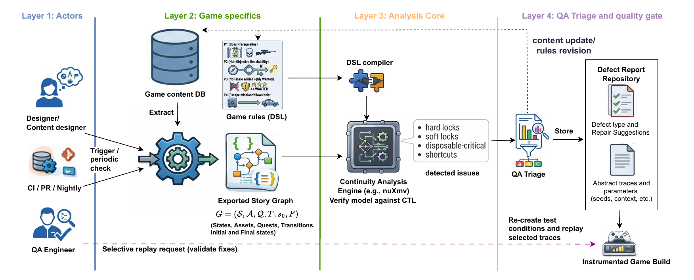

# Verifying Story Continuity During Game Content Evolution

This repository accompanies the research prototype for:

**Verifying Story Continuity During Game Content Evolution with Resource-Annotated Graphs**

The project studies how narrative progression metadata can be checked for story-continuity defects before those defects reach integration testing. The prototype represents a chapter as a resource-annotated story graph, evaluates authored continuity requirements over abstract configurations, reports violations with counterexample traces, and demonstrates how selected traces can be replayed through Unity runtime hooks.

The public artefact is intended to support inspection and reproduction of the Unity-based part of the method. It does not contain private industrial datasets or project-specific commercial adapters.

## Workflow



Figure sources:

- [Flow.pdf](docs/paper/Flow.pdf)
- [Flow.drawio](docs/paper/Flow.drawio)
- [Flow.drawio.pdf](docs/paper/Flow.drawio.pdf)

## Artefact Contents

The repository contains:

- a Python checker for story-continuity analysis;
- four analysis modes: structural reachability (SR), asset-agnostic reachability with quests (AQ), resource-aware reachability (RA), and symbolic continuity (SC);
- a lightweight requirements DSL for prerequisites, bounded progress, and ordering constraints;
- schema validation for exported story graphs;
- NuSMV model generation and optional NuSMV execution;
- JSON, Markdown, CSV, metrics, root-cause grouping, and replay-trace outputs;
- a Unity ScriptableObject chapter model and editor exporter;
- a Unity runtime adapter and replay harness;
- PlayMode tests for runtime transition execution and replay;
- a compact seeded ground-truth set for reproducibility.

## Documentation

- [Paper source](docs/paper/main.tex)
- [Paper artefacts](docs/paper/README.md)
- [Implementation notes](docs/implementation-notes.md)
- [Paper-to-code traceability matrix](docs/paper-traceability.md)
- [Demo walkthrough](docs/demo-walkthrough.md)
- [Verification commands](docs/ci-commands.md)
- [Unity demo notes](unity-demo/README.md)
- [NuSMV installation notes](tools/README.md)

## Repository Layout

```text
checker/                    Python checker, DSL, schema validation, reports, metrics, NuSMV export
examples/unity_chapter/      Seeded story graph, rules, ground truth, generated reports and traces
unity-demo/                  Unity exporter, runtime adapter, replay harness, and PlayMode tests
docs/                        Paper source, workflow figure, traceability notes, and walkthroughs
tools/                       NuSMV installation notes and optional local tool directory
verify.ps1                   Reproducibility script for local validation
```

## Reproducing the Demo

From the repository root:

```powershell
powershell -NoProfile -ExecutionPolicy Bypass -File .\verify.ps1
```

Optional switches:

- `-SkipUnity`: run Python, checker, metrics, and NuSMV validation only.
- `-SkipNuSMV`: run without the local NuSMV executable.
- `-UnityPath <path>`: override Unity auto-detection.
- `-CleanUnityCache`: remove generated Unity cache folders after validation.

Expected validation results for the current artefact:

- Python unit tests: 5 passed;
- Unity PlayMode tests: 4 passed, 0 failed;
- SC analysis: 52 reachable abstract configurations;
- SC report: 20 violations grouped into 11 root causes;
- seeded demo ground truth: 6/6 entries detected by SC.

## Scope and Limitations

The repository is a compact replication artefact, not the complete empirical dataset. In particular:

- the commercial case-study data described in the paper is not included;
- the Unity demo is smaller than the paper-scale Unity evaluation dataset;
- bounded DSL obligations are checked by the Python analysis, while the generated NuSMV file records them as comments rather than as an extended bounded-unrolling model;
- replay is implemented through stable Unity runtime hooks, not through UI automation;
- aggregate timing, memory, and replay-success measurements are not yet generated automatically.

The detailed mapping between paper claims and repository artefacts is maintained in [docs/paper-traceability.md](docs/paper-traceability.md).
